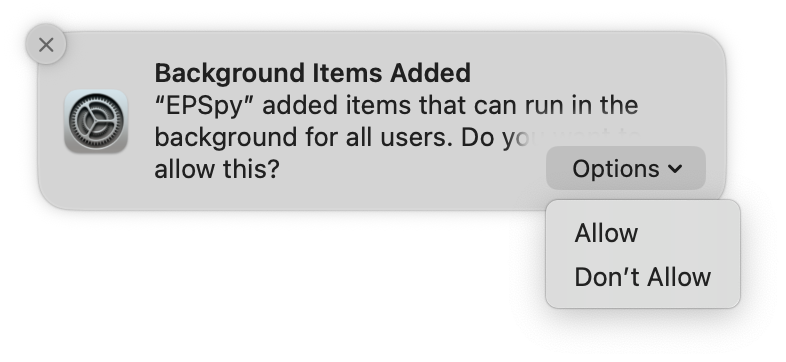
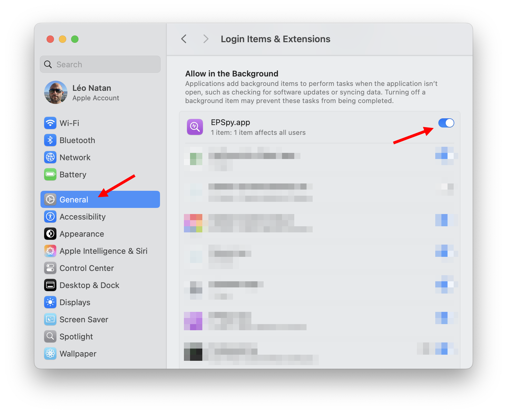
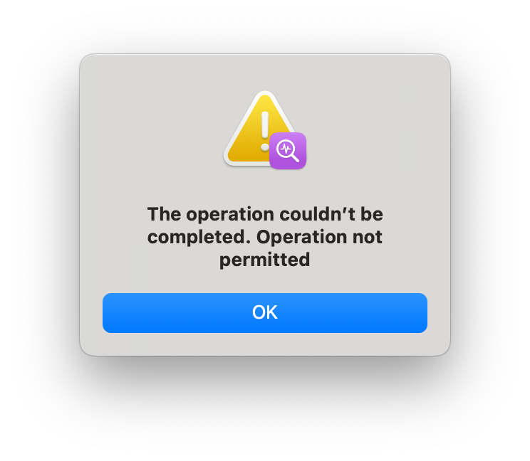

# EPSpy

Records supported [EndpointSecurity.framework](https://developer.apple.com/documentation/endpointsecurity) events into a JSON file.

<p align="center"></p>

### Installing

Release binaries are signed with adhoc certificate and have the `com.apple.developer.endpoint-security.client` entitlement, so it is required that `SIP` and/or `AMFI` [be disabled](https://gist.github.com/LeoNatan/b1cf77e1a0df2558f02631656e596408) to run. It is recommended to run this tool in a VM.

To install EPSpy, download the latest release from the releases page. Extract to `/Applications`. Run the following command:

```shell
xattr -r -d com.apple.quarantine /Applications/EPSpy.app
```

To uninstall, delete `EPSpy.app` from `/Applications`.

### Running

On first run record, the system will ask you to enable an extension. You can enable it right away in the notification:

<p align="center"></p>

 or in **Settings**, under **Login Items & Extensions**:

<p align="center"></p>

### Troubleshooting

- The following error indicates that the login item has not been enabled.

<p align="center"></p>

- If you click on the record button and nothing happens, including no error, it means you are trying to record on a machine that is SIP enabled. Disable SIP and try again.
