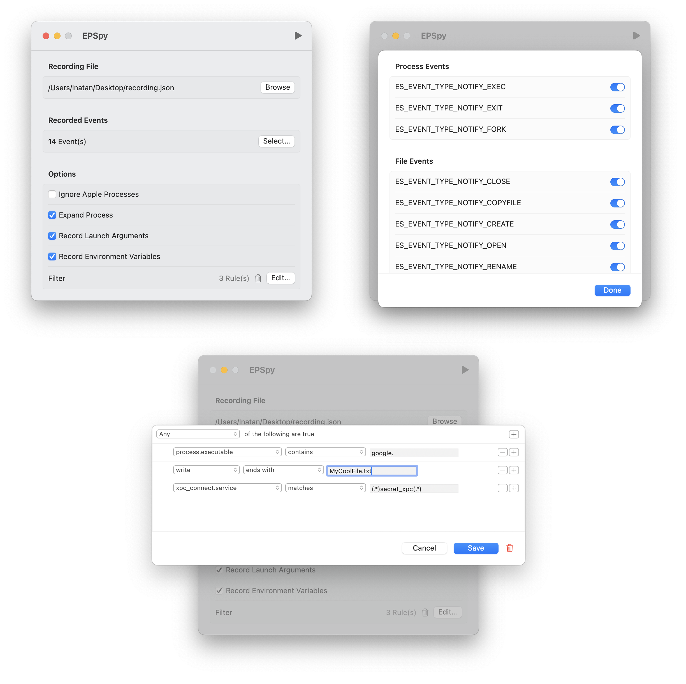

# EPSpy

Records supported [EndpointSecurity.framework](https://developer.apple.com/documentation/endpointsecurity) events into a JSON file.

Release binaries are signed with adhoc certificate and have the `com.apple.developer.endpoint-security.client` entitlement, so it is required that `SIP` and/or `AMFI` [be disabled](https://gist.github.com/LeoNatan/b1cf77e1a0df2558f02631656e596408) to run. It is recommended to run this tool in a VM.

To install or upgrade:

```shell
curl --create-dirs -O --output-dir /tmp https://raw.githubusercontent.com/LeoNatan/EPSpy/refs/heads/master/epspy.rb
brew install --force --no-quarantine --cask /tmp/epspy.rb
```

To uninstall:

```shell
curl --create-dirs -O --output-dir /tmp https://raw.githubusercontent.com/LeoNatan/EPSpy/refs/heads/master/epspy.rb
brew uninstall --cask /tmp/epspy.rb
```


----


<p align="center"></p>

